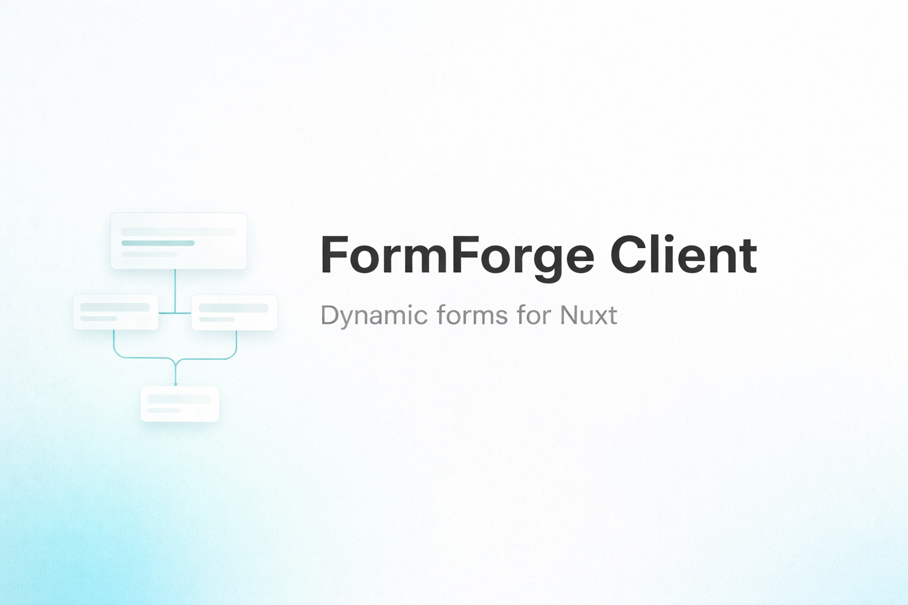

<p align="center">
  
</p>

<h1 align="center">FormForge Client</h1>

<p align="center">
  Nuxt 4 client and Nuxt UI v4 renderer for FormForge.
</p>

<p align="center">
  <a href="https://github.com/EvanSchleret/FormForgeClient/actions/workflows/ci.yml"></a>
  <a href="./LICENSE"></a>
  
  
  
</p>

## Why this package

`@formforge/client` is the frontend companion for FormForge backend APIs.

It provides:

- a typed runtime HTTP client
- auto-imported Nuxt composables
- a Nuxt UI form renderer
- a Nuxt UI form builder
- support for `managed`, `direct`, and `staged` file submission
- responses and management helpers (forms, revisions, diff)

## Dependency

This package requires the FormForge backend to work:

- [evanschleret/formforge (FormForge)](https://github.com/EvanSchleret/formforge)

## Requirements

- Nuxt `4.x`
- `@nuxt/ui` `4.x`
- Node.js `>=20` or Bun `>=1.3`

## Installation

Use your preferred package manager:

```bash
npm install @formforge/client
```

```bash
pnpm add @formforge/client
```

```bash
yarn add @formforge/client
```

```bash
bun add @formforge/client
```

## Nuxt setup

```ts
// nuxt.config.ts
export default defineNuxtConfig({
  modules: ['@nuxt/ui', '@formforge/client'],
  formforgeClient: {
    baseURL: '/api/formforge/v1',
    credentials: 'include',
    uploadMode: 'staged',
    datetimeMode: 'offset',
    locale: 'en',
    autoImports: true
  }
})
```

## Auto-imports

When `autoImports` is enabled (default), composables are available without manual imports:

- `useFormForgeApi`
- `useFormForgeClient`
- `useFormForgeSchema`
- `useFormForgeGetForm`
- `useFormForgeI18n`
- `useFormForgeResolver`
- `useFormForgeDrafts`
- `useFormForgeUploads`
- `useFormForgeForm`
- `useFormForgeSubmit`
- `useFormForgeSubmission`
- `useFormForgeResponses`
- `useFormForgeManagement`
- `useFormForgeWizard`
- `useFormForgeBuilder`

## Renderer quick start

### Internal mode (recommended)

Pass only a `form-key` and the renderer handles fetch + submit internally.

```vue
<script setup lang="ts">
const route = useRoute()
</script>

<template>
  <FormForgeRenderer
    :form-key="String(route.params.form)"
    simulation
    show-progress
    progress-variant="stepper"
    show-alert-on-error
    clear-after-submit
    submit-label="Send (simulation)"
    @submitted="(response) => console.log(response)"
    @error="(message) => console.error(message)"
  />
</template>
```

### Controlled mode (advanced)

Use this when you want full control over state and submission.

```vue
<script setup lang="ts">
const route = useRoute()

const form = useFormForgeForm({
  key: String(route.params.form),
  immediate: true
})

const submitter = useFormForgeSubmit({
  key: String(route.params.form),
  schema: () => form.schema.value,
  state: () => form.state.value
})

async function onSubmit(): Promise<void> {
  await submitter.submit({
    mode: 'staged',
    test: true
  })
}
</script>

<template>
  <div class="space-y-4">
    <FormForgeRenderer
      v-if="form.schema"
      :schema="form.schema"
      :model-value="form.state"
      :zod-schema="form.zodSchema"
      show-progress
      show-alert-on-error
      @update:model-value="form.replaceState"
    />

    <UButton
      :loading="submitter.submitting"
      @click="onSubmit"
    >
      Submit
    </UButton>
  </div>
</template>
```

Notes:

- in controlled mode, you own submit flow (button + `useFormForgeSubmit`)
- `show-progress` is active only when the schema has multiple visible pages
- supported progress variants are `stepper` and `progress`

## Builder quick start

```vue
<script setup lang="ts">
const route = useRoute()

const model = ref({
  uuid: null,
  key: null,
  title: 'New form',
  category: null,
  pages: [],
  conditions: [],
  drafts: { enabled: true }
})
</script>

<template>
  <FormForgeBuilder
    v-model="model"
    :load-form-key="String(route.params.form)"
    :autosave="true"
    :autosave-delay="5000"
    @save="(draft) => console.log('saved', draft)"
    @publish="(draft) => console.log('published', draft)"
    @unpublish="(draft) => console.log('unpublished', draft)"
    @error="(message) => console.error(message)"
  />
</template>
```

Notes:

- updates/publish actions use the form UUID on backend mutation endpoints
- `load-form-key` can be a UUID key to preload a form into the builder

## Responses composable

```ts
const responses = useFormForgeResponses({
  key: '8f0c189e-a9d2-484b-9438-b6166db81462',
  immediate: true,
  querySync: {
    enabled: true,
    pageKey: 'page',
    perPageKey: 'per_page',
    extraKeys: ['search', 'sort']
  }
})

await responses.getResponse('submission-uuid')
await responses.deleteResponse('submission-uuid')
await responses.refresh()
await responses.refresh({ mode: 'list' })
await responses.refresh({ mode: 'resource', submissionId: 'submission-uuid' })
```

Notes:

- `list` is loaded automatically when `immediate` is `true` (default)
- route query changes re-trigger list loading when `querySync.enabled` is `true` (default)
- in template, iterate with `v-for="item in responses.list"` and a stable key like `item.submission_id`

Routes used:

- `GET /forms/{key}/responses`
- `GET /forms/{key}/responses/{submissionId}`
- `DELETE /forms/{key}/responses/{submissionId}`

## Management composable

```ts
const management = useFormForgeManagement()

const forms = await management.listForms()
await management.refreshForms()
await management.createForm({
  title: 'Contact form',
  pages: [],
  fields: [],
  conditions: [],
  drafts: { enabled: true }
})

const formUuid = '8f0c189e-a9d2-484b-9438-b6166db81462'

await management.patchForm(formUuid, {
  title: 'Contact form v2',
  pages: [],
  fields: [],
  conditions: [],
  drafts: { enabled: true }
})
```

Also available:

- `refreshForms` (alias `refresh`)
- `publishForm`
- `unpublishForm`
- `deleteForm`
- `getRevisions`
- `getDiff`

## Upload modes

Upload behavior is backend-defined. Client submission mode chooses the request format:

- `staged` default, uploads staged then submitted as tokens
- `managed` multipart submit
- `direct` JSON file references (`disk`, `path`, ...)

Per-submit override:

```ts
await submitter.submit({ mode: 'managed' })
```

## Datetime behavior

- `offset` default, sends browser-local offset (`2026-03-20T14:00:00+01:00`)
- `utc` sends UTC ISO format

Backend-managed fields are not sent by the submit composable:

- `submitted_by_id`
- `submitted_by_type`
- `type`
- `updated_at`
- `ip_address`

## Runtime API and auth hooks

`FormForgeClientConfig` supports:

- `fetch`
- `headers`
- `credentials`
- `beforeRequest`

Nuxt hook for auth/header injection before every FormForge request:

```ts
// plugins/formforge-auth.client.ts
export default defineNuxtPlugin((nuxtApp) => {
  nuxtApp.hook('formforge:beforeRequest', ({ headers }) => {
    const token = useCookie<string | null>('auth_token')

    if (typeof token.value === 'string' && token.value !== '') {
      headers.Authorization = `Bearer ${token.value}`
    }
  })
})
```

With Sanctum cookie auth, keep `credentials: 'include'`.

## Development

Use any package manager:

```bash
npm install
npm run lint
npm run typecheck
npm run test
npm run build
```

```bash
pnpm install
pnpm lint
pnpm typecheck
pnpm test
pnpm build
```

```bash
bun install
bun run lint
bun run typecheck
bun run test
bun run build
```

## Roadmap

- [x] Nuxt 4 module and runtime client
- [x] Nuxt UI renderer with internal and controlled modes
- [x] Nuxt UI builder with autosave and publish flow
- [x] Responses composable (list/get/delete/refresh)
- [x] Runtime auth hook (`formforge:beforeRequest`)
- [ ] Extended renderer examples and recipes
- [ ] More composable-focused integration examples
- [ ] Dedicated API reference page for all options and events

## Other packages

If you want to explore more of my packages:

- [evanschleret/lara-mjml](https://github.com/EvanSchleret/lara-mjml)
- [evanschleret/laravel-user-presence](https://github.com/EvanSchleret/laravel-user-presence)
- [evanschleret/laravel-typebridge](https://github.com/EvanSchleret/laravel-typebridge)
- [evanschleret/formform (FormForge)](https://github.com/EvanSchleret/formforge)

## Open source

- Contributing guide: [CONTRIBUTING.md](CONTRIBUTING.md)
- Security policy: [SECURITY.md](SECURITY.md)
- Code of conduct: [CODE_OF_CONDUCT.md](CODE_OF_CONDUCT.md)
- License: [LICENSE](LICENSE)
